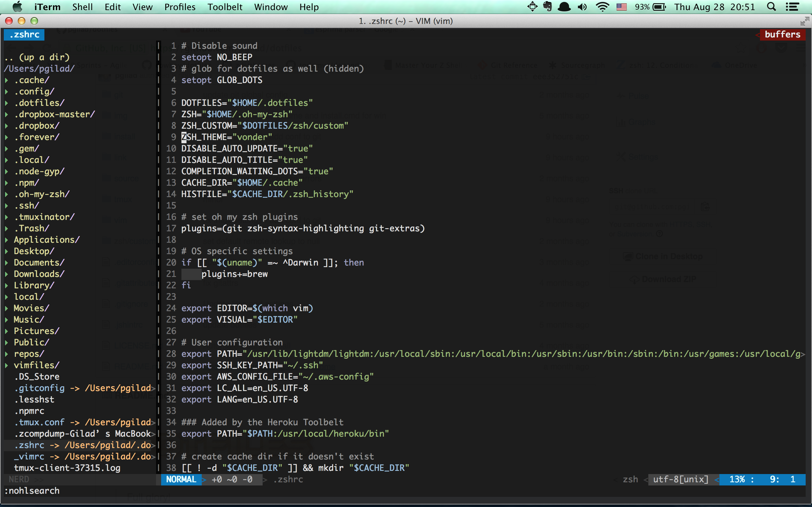

# 
> Full glory!

## Overview
My config files, mainly Vim, Tmux, Git & Zsh aimed at working in Linux & OSX.

## Key Features
- Uses [NeoBundle](https://github.com/Shougo/neobundle.vim) as package manager.
- Uses [Unite](https://github.com/Shougo/unite.vim) as an all-around explorer.
- Zsh with [Zplug](https://github.com/zplug/zplug).
- Awesome **shell prompt** based on [pure](https://github.com/sindresorhus/pure)
- Geared towards portability.
- Equipped to handle web development (HTML/CSS/JS/Frameworks/etc...)
- NERDTree/CtrlP for browsing


## Dependencies

- `Git`

## Installation

```sh
# Git clone this repository into your `~/.dotfiles`
$ git clone https://github.com/pgilad/dotfiles.git ~/.dotfiles

# Make sure you have Zsh as your shell
$ chsh -s /bin/zsh
$ exec zsh

# Run bootstrap script on Linux/OSX
$ . ~/.dotfiles/install/install.zsh

# Optionally apply hacker defaults on OSX
$ . ~/.dotfiles/install/osx.sh

# After installation is complete, open a new shell or run:
$ . ~/.zshrc
$ zplug install

# To update plugins
$ zplug update
```

### What happens during install & load

- Files from `link` are symlinked to `~/`.
- If `~/.extra` exists it is sourced on profile load.
- Git config is extended with `~/.gitconfig.local` if it exists.

### Overriding settings

#### Profile overrides

Place any profile load overrides you want in `~/.extra`

#### Git overrides

To override `.gitconfig` params add a `~/.gitconfig.local` file.
Anything you add here will extend and override existing params from `.gitconfig`.

For example:

```
[user]
    name = Gilad Peleg
    email = giladp007@gmail.com
```

#### Customizing iTerm2 Themes:

- Clone [iTerm2-Color-Schemes](https://github.com/mbadolato/iTerm2-Color-Schemes)
- Import your favorite theme in iTerm2 -> Profiles -> Colors -> Import Theme
- Profit$$

## Vim



- Main file is `_vimrc`.
- Bundles files (bundled using `NeoBundle`) is `bundles.vim`.
- Update bundles using `NeoBundleUpdate`.
- Custom snippets are in the directory `mysnippets` and are auto-loaded according to filetype.

```vim
"@author Gilad Peleg
"@license MIT 2014
"@website https://github.com/pgilad/dotfiles

" Note: Skip initialization for vim-tiny or vim-small.
if !1 | finish | endif
" Note: Vim is old
set nocompatible

let g:config =  {
            \ 'baseDir': '~/.dotfiles/vim/rc/',
            \ 'loadFiles': {},
            \ 'bundlesPath': '~/vimfiles/bundle/',
            \ 'spellDir' : '~/.dotfiles/vim/spell/',
            \ 'spellFile' : '~/.dotfiles/vim/spell/en.utf-8.add',
            \ 'undoDir' : '~/.cache/undo/',
            \ 'env' : {
            \   'windows': has('wind16') || has('win32') || has('win64'),
            \   'cygwin': has('win32unix'),
            \   'mac': has('mac'),
            \   'unix': has('unix') && !has('gui_macvim')
            \ }
            \}

" map leader keys
let g:mapleader = ","
let g:maplocalleader = ","

set guioptions=Mc
" set guioptions+=a " visual select auto-copy to clipboard

if has('syntax')
    syntax off
    filetype plugin indent off
endif

" How to quickly load the files:
" Mapping     |  File
" ---------------------------
" <leader>eg  |  Gui
" <leader>eb  |  Bundles
" <leader>es  |  Settings
" <leader>em  |  Mappings
" <leader>ea  |  autoCommands
for fileToLoad in ['bundles', 'settings', 'mappings', 'autoCommands']
    " set filename
    let b:filePath = g:config.baseDir . fileToLoad . '.vim'
    " set file object in config
    let g:config.loadFiles[fileToLoad] = b:filePath
    " source script
    silent execute 'source ' . fnameescape(expand(b:filePath))
endfor

set secure
```

## Zsh

- Uses Zplug alongside customization and completion

## Thanks (in no particular order)

- [Shougo's dotfiles](https://github.com/Shougo/shougo-s-github)
- [Cowboy's dotfiles](https://github.com/cowboy/dotfiles)
- [Mathias's dotfiles](https://github.com/mathiasbynens/dotfiles)

## License

MIT @[Gilad Peleg](http://giladpeleg.com)
